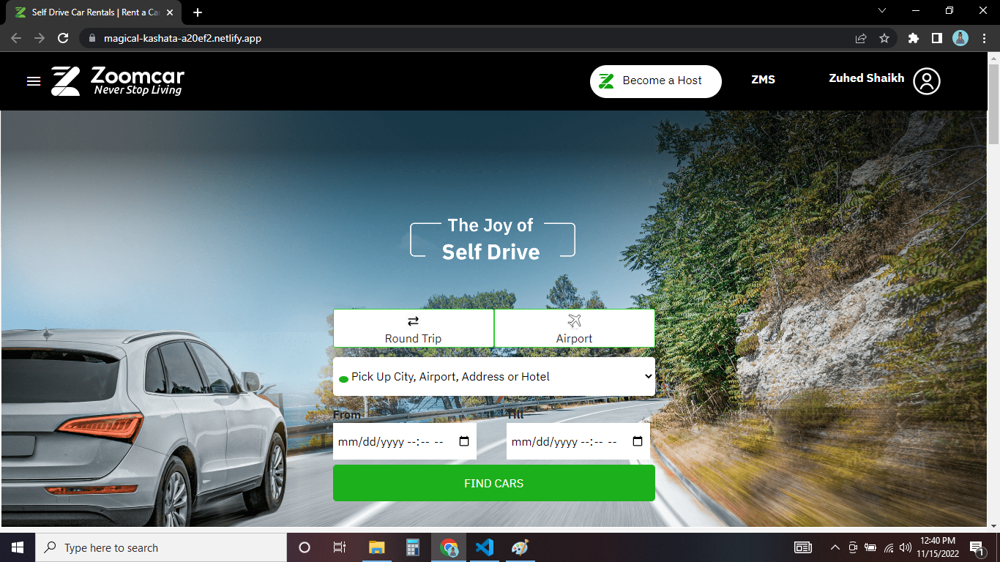
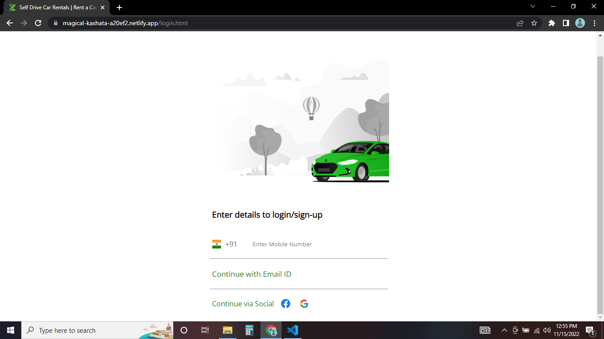
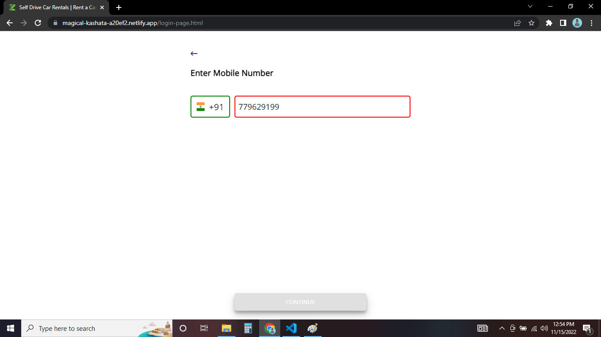
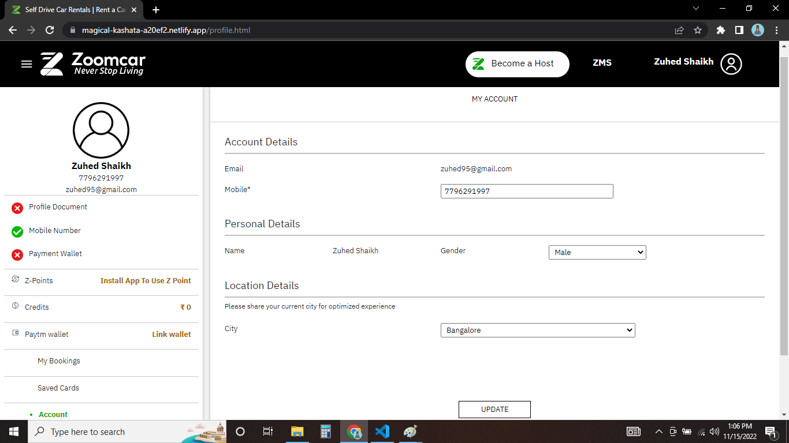
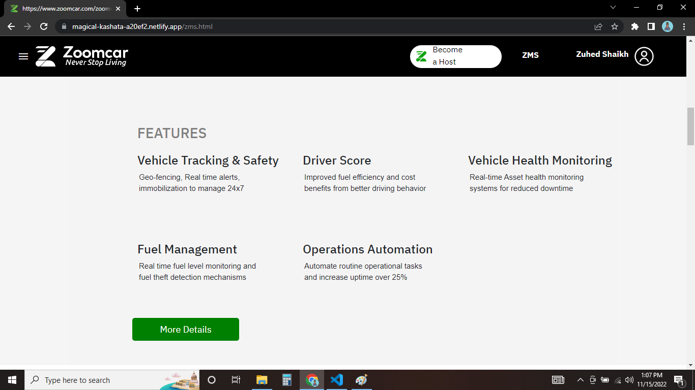
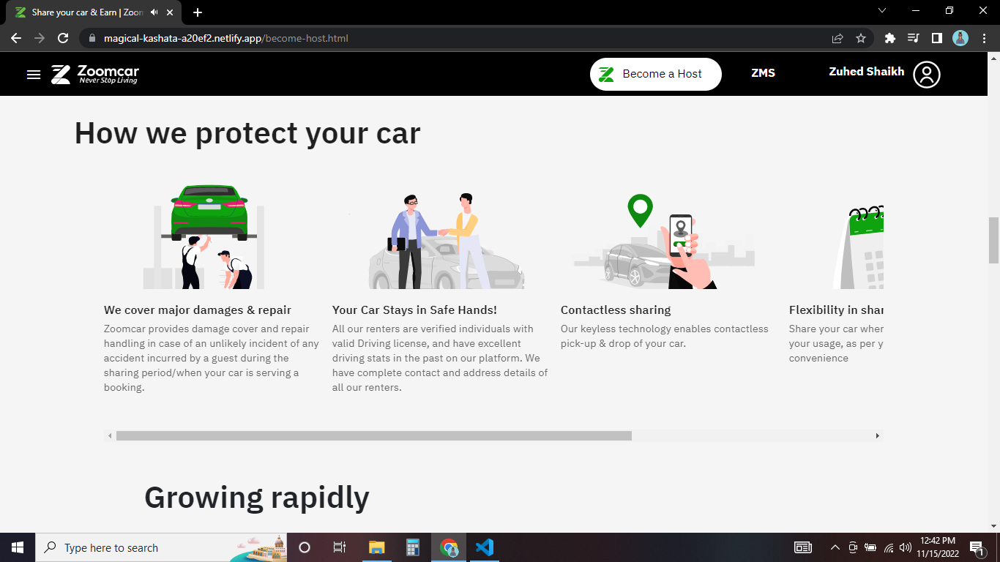
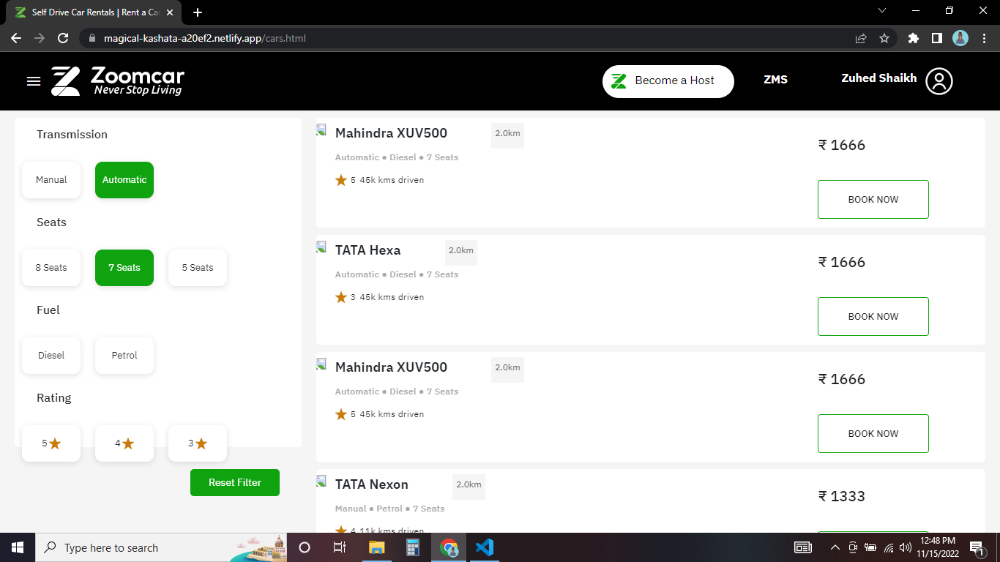
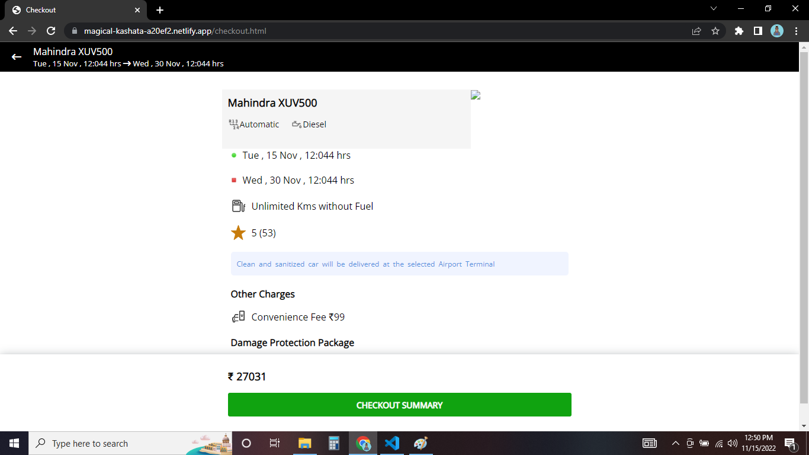
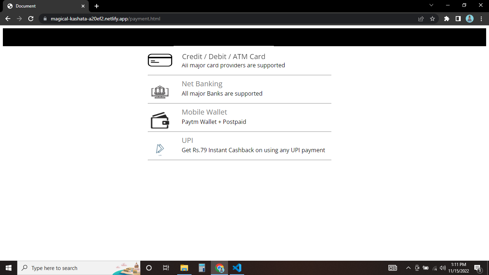

# Zoomcar-Clone
Zoomcar is an Indian car sharing platform, headquartered in Bangalore. The company was founded in 2013 by David Back and Greg Moran. It currently operates in 34+ cities.

## Demo

[Zoomcar](https://magical-kashata-a20ef2.netlify.app/)

## Tech Stack

- HTML
- CSS
- JavaScript
- Bootstrap

## Features

- ### Landing Page
    - 

     
     
     
     

- ### Signup Page
    - 

     
     
     
     

- ### - 

     
     
     
     

- ### User Profile Page
    - 

     
     
     
     

- ### ZMS Page
    - 

     
     
     
     

- ### Become A Host Page
    - 

     
     
     
     

- ### Cars Page
    - 

     
     
     
     

- ### Checkout and Checkout Summary Page
    - 

     
     
     
     

- ### Payment Page
    - 

     
     
     
     

## Execution

If you want to run our project in your local machine

- Clone our respository
- Open our code in VS code
- Open file `index.html` with live server

## Creators

- [Zuhed Shaikh](https://github.com/zuhedshaikh95) (Project Lead)
- [Raj Rathore](https://github.com/Raj-1313)
- [Ramyapriya Kota](https://github.com/kotaRamyapriya)
- [Mitali Sinha](https://github.com/mira713)
- [Prasad Karde](https://github.com/PrasadK05/)

